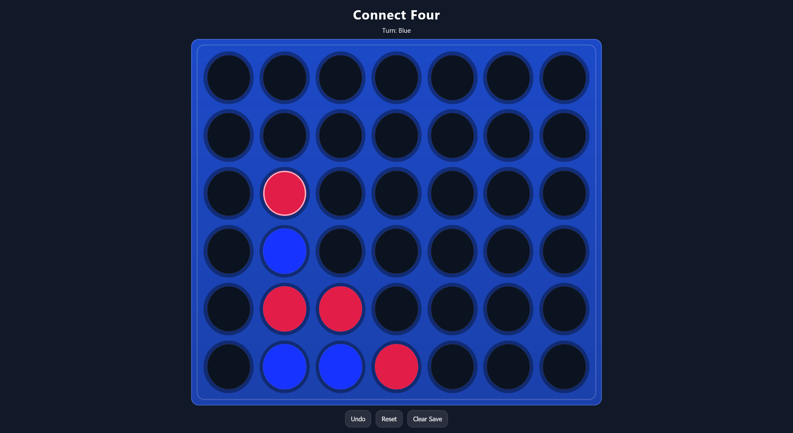
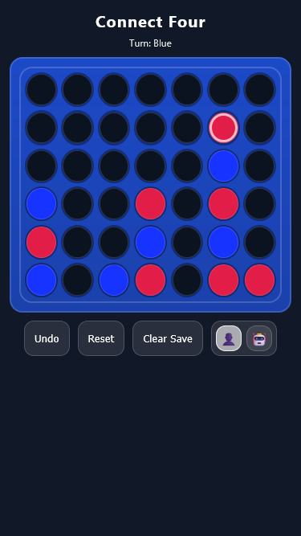
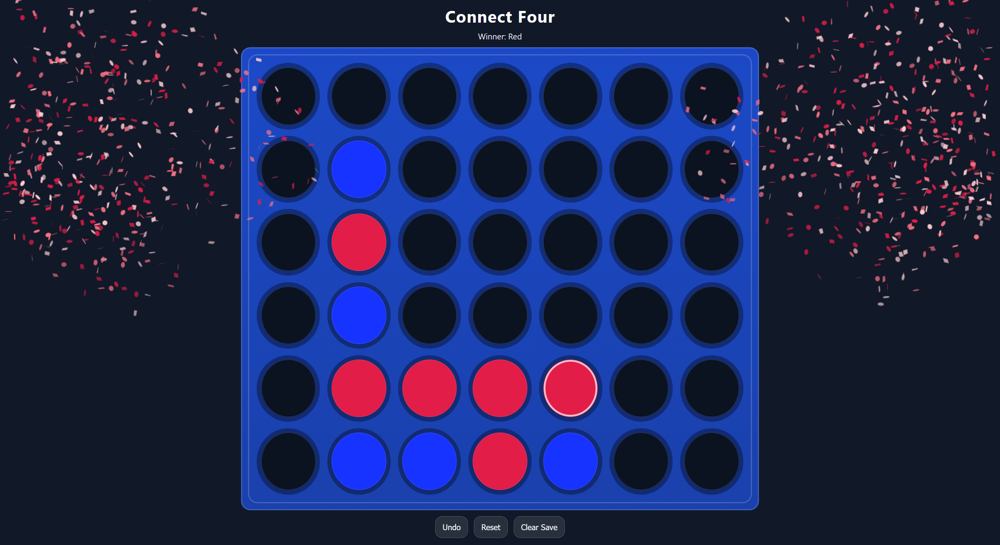
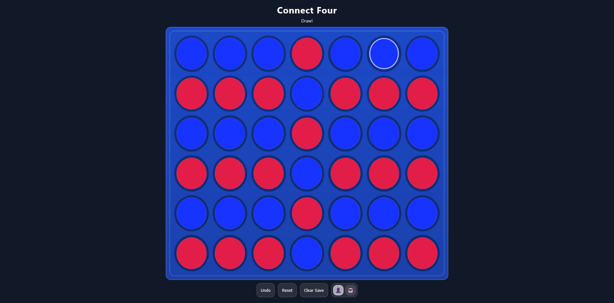

# Connect Four

## Project Overview
This project is a web-based implementation of the classic **Connect Four** game.  
It was developed as a mini project using **React**, **TypeScript**, and **Vite**, with a focus on clean state management, persistence, and responsive design.

The game is fully playable in the browser and deployed via **GitHub Pages**.

---

## Team
- [Maxim Zelensky](https://github.com/MaxZell)

---

## Features

### Core Gameplay
- Two-player Connect Four game (Red vs. Blue)
- Turn-based gameplay
- Automatic detection of:
    - Horizontal wins
    - Vertical wins
    - Diagonal wins
    - Draw situations

### State Management
- Game state is managed using a custom `useHistoryState` hook
- Full **undo functionality** (multiple undo steps)
- Game state is **persisted in localStorage**
    - Reloading the page restores the last game

### Controls
- **Undo**: Reverts the last move
- **Reset**: Starts a new game (in-memory reset)
- **Clear Save**: Deletes the persisted game state from localStorage

### Visual & UX Features
- Fully responsive design (desktop and mobile)
- Board always fits within the viewport (no scrolling)
- Clear visual distinction between players
- Highlight of the last move
- Confetti animation when a player wins

---

## Technical Details

- **Framework**: React + TypeScript
- **Build Tool**: Vite
- **State Persistence**: Browser `localStorage`
- **Styling**: CSS
- **Deployment**: GitHub Pages (via GitHub Actions)

Game logic (win detection, move handling) is implemented efficiently by checking only the last placed disc, ensuring constant-time performance per move.

---

## Game
Game can be played [here](https://maxzell.github.io/connect-four-game/).

---

## Screenshots
### Desktop View

### Mobile View

### Win States
**Red Player Wins**  

**Blue Player Wins**  

**Draw**  
